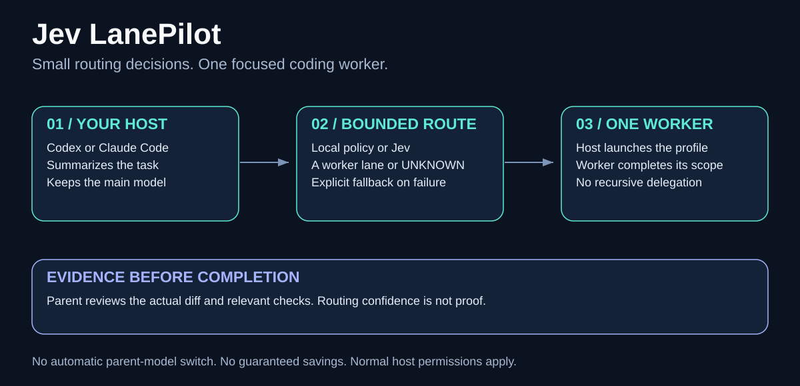
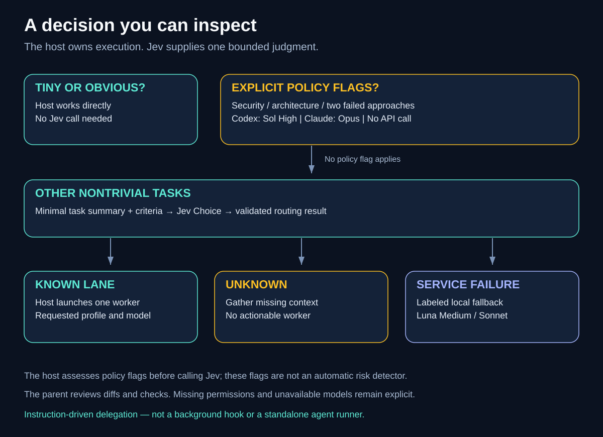

# Jev LanePilot

[English](README.md) · **Polski**

**Małe decyzje o doborze modelu. Jeden wykonawca skupiony na zadaniu.**



Nieoficjalna integracja w Node.js, bez dodatkowych zależności, która pyta TypeSafe Jev o zalecany profil wykonawcy dla **Codexa** lub **Claude Code**. Agent prowadzący uruchamia wykonawcę i sprawdza jego wyniki. Główny czat zachowuje wybrany model.

Projekt jest dostępny na [licencji MIT](LICENSE). Zobacz [pochodzenie materiałów i informacje o licencji](docs/PROVENANCE.md).

## Dlaczego ta implementacja?

- **Jawne źródło decyzji:** odróżnia odpowiedź Jev, lokalną regułę i wybór awaryjny po błędzie usługi.
- **Obsługa niepewności:** `UNKNOWN` nie wskazuje wykonawcy — najpierw trzeba zebrać brakujący kontekst.
- **Niewielki kod do przejrzenia:** wbudowane moduły Node, pytanie z zamkniętym zestawem odpowiedzi, stały adres API i brak automatycznych ponowień.
- **Profile dla obu aplikacji:** modele i poziomy rozumowania w Codexie oraz aliasy modeli w Claude; jeden wykonawca naraz.
- **Praktyczne ograniczenia:** pomijanie drobnych zmian, minimalny kontekst i weryfikacja za pomocą narzędzi.
- **Podgląd instalacji:** najpierw lista plików docelowych; istniejące pliki nie są nadpisywane.

Przepływem sterują instrukcje skilla. Nie jest to stale działający hook ani pośrednik przełączający modele. CLI zwraca dane doboru i **samo nie uruchamia agenta**. Automatyczne wykonanie wymaga wczytania skilla, stosowania jego instrukcji oraz zgodnego narzędzia delegacji w aplikacji.

## Dostępne profile

| Aplikacja | Zwykły wybór | Lokalna reguła ryzyka / powtarzających się niepowodzeń | Wybór awaryjny przy błędzie usługi |
| --- | --- | --- | --- |
| Codex | Luna Low, Medium, High; Sol High | Sol High | Luna Medium |
| Claude Code | Haiku, Sonnet, Opus | Opus | Sonnet |

Profile Codexa używają `gpt-6-luna` i `gpt-6-sol`, a Claude — aliasów `haiku`, `sonnet` i `opus`. Dostępność zależy od konta i aplikacji. Brak obsługi modelu trzeba zgłosić, zamiast twierdzić, że został uruchomiony. Jeśli aplikacja używa innych identyfikatorów, zaktualizuj jednocześnie mapowanie routera i profile wykonawców. Nie ma gwarancji, że wybrany profil będzie najtańszym wystarczającym rozwiązaniem.

## Wymagania

- Node.js **22 lub nowszy**, dostępny w PATH aplikacji.
- Lokalny Codex lub Claude Code z obsługą skilli i agentów wykonawczych oraz aktywnym logowaniem.
- Konto TypeSafe i zmienna `TYPESAFE_API_KEY` dostępna w środowisku aplikacji.
- Zgoda na przesłanie minimalnego opisu zadania do TypeSafe. Dane opuszczają komputer — zobacz [bezpieczeństwo i przepływ danych](docs/SECURITY.md).

Nie trzeba instalować zależności npm. `.env.example` służy wyłącznie jako przykład; pakiet nie wczytuje plików `.env`.

## Szybki start

Uruchom polecenia z katalogu przejrzanego repozytorium:

```sh
node --version
node --test tests/*.test.mjs
```

### 1. Bezpiecznie udostępnij klucz

Użyj systemowego edytora zmiennych środowiskowych lub menedżera sekretów. Ustaw `TYPESAFE_API_KEY` poza repozytorium, a następnie uruchom aplikację ponownie, aby odziedziczyła zmienną. Nie wklejaj prawdziwego klucza do czatu, kodu ani polecenia zapisywanego w historii terminala.

W Windows otwórz **Edytuj zmienne środowiskowe dla konta**, dodaj zmienną użytkownika i uruchom Codexa lub Claude Code ponownie. W macOS/Linux skorzystaj ze swojej integracji menedżera sekretów, aby uruchomić aplikację z tą zmienną. Już uruchomione aplikacje graficzne nie muszą dziedziczyć zmiennych ustawionych w terminalu.

Sprawdź obecność klucza w PowerShellu bez wyświetlania wartości:

```powershell
[bool]$env:TYPESAFE_API_KEY
```

Nie osłabiaj całej polityki środowiska lub uprawnień aplikacji, aby udostępnić jedną zmienną.

### 2. Podejrzyj instalację i zainstaluj wybraną integrację

**Codex** (jeśli używasz innego katalogu domowego Codexa, podaj jego ścieżkę):

```powershell
node scripts/install.mjs --host codex --target "$HOME/.codex"
node scripts/install.mjs --host codex --target "$HOME/.codex" --apply
```

**Claude Code:**

```powershell
node scripts/install.mjs --host claude --target "$HOME/.claude"
node scripts/install.mjs --host claude --target "$HOME/.claude" --apply
```

Te ścieżki rozwijają się również w powłoce POSIX. Pakiet zaprojektowano z myślą o przenośności, ale sprawdzano go w Windows — nie przeprowadzono zestawu testów w macOS/Linux.

Katalog docelowej aplikacji musi już istnieć. Instalator tworzy skill i profile wykonawców. Nie zmienia globalnych instrukcji, danych logowania ani uprawnień. Istniejące pliki docelowe powodują błąd: przejrzyj je lub samodzielnie wykonaj kopię zapasową; nie ma opcji wymuszonego nadpisania. Dotyczy to również profili z wcześniejszej prywatnej instalacji.

### 3. Włącz automatyczną delegację

Przejrzyj odpowiedni fragment i ręcznie połącz go z globalnymi instrukcjami aplikacji:

- Codex: [fragment AGENTS](templates/codex/AGENTS.fragment.md) do aktywnego globalnego `AGENTS.md`.
- Claude Code: [fragment CLAUDE](templates/claude/CLAUDE.fragment.md) do `~/.claude/CLAUDE.md`.

Zachowaj pozostałe instrukcje. Rozpocznij nowy lokalny czat i poproś o użycie **jev-lanepilot** przy zadaniu programistycznym o określonym zakresie. Poproś o podanie źródła decyzji i faktycznie uruchomionego wykonawcy. Nadal obowiązują zwykłe zgody na narzędzia. Sama instalacja nie gwarantuje wywołania w każdej rozmowie. Czaty przeglądarkowe i środowiska zdalne lub chmurowe nie dziedziczą tej instalacji.

### 4. Opcjonalnie sprawdź router z prawdziwym API

To polecenie przesyła syntetyczny przykład do TypeSafe i może naliczyć użycie API. Nie uruchamia wykonawcy.

```powershell
Get-Content examples/task.json -Raw | node src/route.mjs --host codex
# Możesz zamienić codex na claude.
```

POSIX:

```sh
node src/route.mjs --host claude < examples/task.json
```

## Jak to działa?



1. Agent prowadzący pomija drobne zmiany i zbiera minimalny opis zadania.
2. Jawne flagi bezpieczeństwa lub niepewności architektonicznej albo dwie nieudane próby powodują lokalną eskalację bez wywołania API. Flagi podaje wywołujący — nie jest to automatyczny wykrywacz zagrożeń.
3. W pozostałych przypadkach Jev wybiera profil lub `UNKNOWN`.
4. Aplikacja uruchamia jednego wykonawcę, zachowując model głównego czatu i zwykłe uprawnienia.
5. Agent prowadzący przegląda rzeczywisty diff i odpowiednie sprawdzenia. Decyzja routera nie dowodzi ukończenia zadania.

Przy błędzie usługi router zwraca oznaczony lokalny wybór awaryjny. Przy `UNKNOWN` zbierz informacje przed delegacją. Nie powtarzaj nieudanych prób bez zmiany podejścia i nie pozwalaj wykonawcom rekurencyjnie wybierać kolejnych wykonawców.

## Wyniki i ograniczenia

Zobacz [opis weryfikacji](docs/VALIDATION.md). Oryginalna lokalna implementacja wykonała wywołania Jev i delegację w obu aplikacjach. Mała syntetyczna ocena dla Codexa była zgodna z oczekiwaniami autora w 7/7 przypadków Jev oraz 3/3 przypadków lokalnych reguł. **Nie dowodzi to** skuteczności produkcyjnej, przewagi w benchmarkach, oszczędności ani nieograniczonego kodowania. Pakiet do dystrybucji jest sprawdzany oddzielnie testami offline.

Rozumowanie głównego agenta, wykonawcy oraz zapytania Jev zużywają limity. Delegacja może zwiększać narzut. Repozytorium nie obiecuje określonego kosztu miesięcznego ani oszczędności.

## Rozwiązywanie problemów

- **Brak klucza:** udostępnij procesowi aplikacji tylko `TYPESAFE_API_KEY` i uruchom aplikację ponownie.
- **UNKNOWN:** doprecyzuj zakres lub wymagania; nie wymuszaj wyboru wykonawcy.
- **Odmowa uprawnień:** uzyskaj zwykłą zgodę aplikacji; nie zmieniaj zapisu polecenia, aby obejść blokadę.
- **Niedostępny model:** sprawdź wersję aplikacji, dostęp konta i obsługiwane identyfikatory. Zgłoś ograniczenie.
- **Wymuszony model Claude:** polityka aplikacji lub `CLAUDE_CODE_SUBAGENT_MODEL_FORCE` może nadpisać profile; podaj faktyczny model, jeśli jest znany.
- **Istniejąca instalacja:** instalator odmawia nadpisania. Przejrzyj pliki przed wyborem sposobu aktualizacji.

## Dodatkowe skille i źródła

Oficjalny skill `typesafe-ai` uczy projektowania aplikacji z TypeSafe. LanePilot kieruje doborem wykonawcy. Mogą współistnieć; nie powielaj zapytania API tylko dlatego, że oba są wczytane. Oficjalny skill jest opcjonalny i nie jest dołączony do pakietu.

[API TypeSafe](https://docs.typesafe.ai/api) · [Oficjalny skill](https://github.com/typesafe-ai/skills) · [Wskazówki społeczności](https://github.com/aaddrick/building-with-typesafe-jev) · [Agenci Codexa](https://learn.chatgpt.com/docs/agent-configuration/subagents) · [Agenci Claude Code](https://code.claude.com/docs/en/sub-agents)

Projekt nie jest powiązany z TypeSafe, OpenAI ani Anthropic i nie jest przez te firmy rekomendowany. Nazwy produktów identyfikują wyłącznie zgodne usługi. Diagramy i dokumenty pomocnicze pozostają w języku angielskim.
